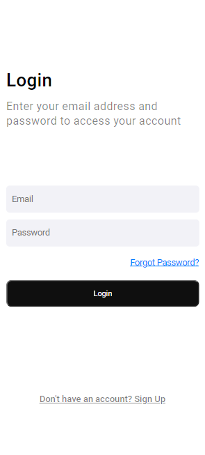

# LOGIN

> Resultado de uma interface de login.

### Ajustes e melhorias

O projeto ainda está concluído:

- [x] Criação do HTML
- [x] Criação do CSS

<table>
  <tr>
    <td align="center">
      <a href="#">
         
        
          <b>Mario Pereira</b>
        
      </a>
    </td>
  </tr>
</table>